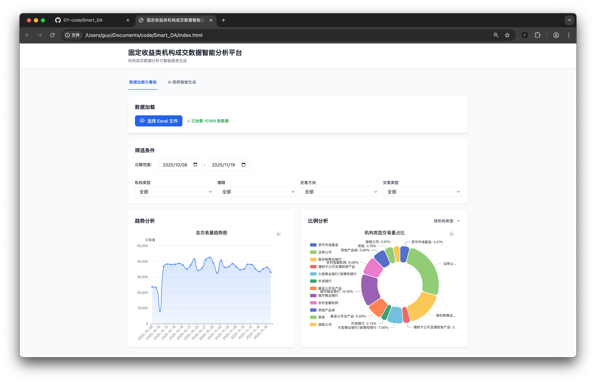
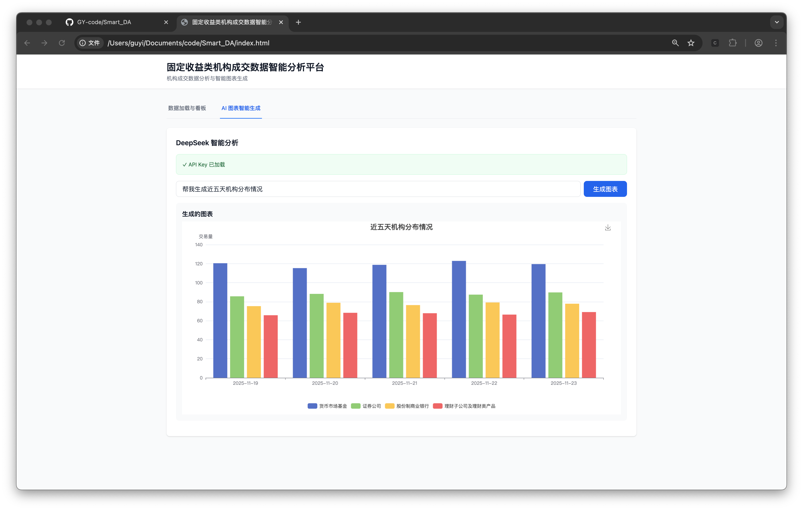

# 固定收益类机构成交数据智能分析平台 - Smart DA

一个基于前端的数据分析看板，支持 Excel 数据导入、可视化分析和 AI 智能图表生成。项目包含前端 Web 应用和后端 API 服务两部分。

## [项目演示](demo/demo-video.mp4)

## 项目截图





## 项目结构

```
Smart_DA/
├── index.html          # 前端主页面
├── js/
│   ├── config.js      # API 配置（API Key 和 Model ID）
│   ├── main.js        # 前端应用主逻辑
│   └── api.js         # AI API 调用逻辑
├── css/
│   └── style.css      # 自定义样式
├── backend/           # 后端 API 服务
│   ├── main.py        # FastAPI 应用
│   ├── utils.py       # AI 代码生成和执行工具
│   ├── requirements.txt # Python 依赖
│   ├── test_api.py    # API 测试脚本
│   └── charts/        # 图表输出目录
└── README.md          # 本文件
```

---

## 前端一体化应用

### 功能特性

1. **数据加载与看板**
   - 支持 Excel 文件（.xlsx, .xls）上传和解析
   - 自动缓存数据到 IndexedDB，刷新页面后自动恢复
   - 多维度数据筛选：
     - 日期范围
     - 机构类型
     - 期限
     - 交易方向
     - 交易类型
   - **趋势分析折线图**：显示选定交易类型的时间趋势，支持下载
   - **比例分析饼图**：支持按机构类型、期限、交易方向、交易类型四个维度统计，支持下载

2. **AI 图表智能生成**
   - 集成火山引擎 DeepSeek 模型
   - 自然语言查询，自动生成 ECharts 图表
   - 支持复杂数据分析需求
   - 生成的图表支持下载功能

### 技术栈

- **Vue 3** - 响应式前端框架（CDN 方式引入）
- **Tailwind CSS** - 现代化样式框架（CDN 方式引入）
- **SheetJS (xlsx)** - Excel 文件解析（CDN 方式引入）
- **Apache ECharts** - 数据可视化（CDN 方式引入）
- **IndexedDB** - 本地数据缓存

### 快速开始

#### 1. 配置 API Key

编辑 `js/config.js` 文件，填入你的火山引擎 API Key 和 Model ID：

```javascript
window.SmartDAConfig = {
    ARK_API_KEY: "your-api-key-here",
    ARK_MODEL_ID: "deepseek-v3-250324"
};
```

获取 API Key：https://console.volcengine.com/ark/region:ark+cn-beijing/apikey

#### 2. 启动应用

- 直接用浏览器打开 `index.html` 文件

#### 3. 使用步骤

1. **上传数据**
   - 在"数据加载与看板"标签页中，点击"选择 Excel 文件"
   - 选择你的数据文件（如 `example/机构成交数据脱敏.xlsx`）
   - 数据会自动缓存，刷新页面后自动恢复

2. **查看看板**
   - 使用筛选条件过滤数据（日期、机构类型、期限、交易方向、交易类型）
   - 选择交易类型查看趋势图
   - 切换饼图维度查看不同维度的占比分析
   - 点击图表右上角的下载按钮保存图片

3. **AI 智能分析**
   - 切换到"AI 图表智能生成"标签页
   - 输入你的分析需求，例如：
     - "请画出不同机构类型的交易量占比饼图"
     - "显示国债-新债在过去一个月的趋势"
     - "对比不同期限的交易量"
   - 点击"生成图表"
   - 生成的图表支持下载

### 注意事项

1. **API Key 安全**：`js/config.js` 包含敏感信息，请勿提交到公开的版本控制系统
2. **数据大小**：AI 功能会发送数据到 API，如果数据量很大（>500行），会自动截取前500行
3. **浏览器兼容性**：建议使用现代浏览器（Chrome、Firefox、Safari、Edge）
4. **数据缓存**：上传的数据会缓存在浏览器的 IndexedDB 中，刷新页面后自动恢复

---

## 后端逻辑接口开放

### 功能特性

- 接收 Excel 文件上传
- 接收用户的分析需求（Prompt）
- 使用 DeepSeek (Volcengine) 生成 Python 绘图代码
- 执行代码生成 matplotlib 图表图片
- 返回 PNG 格式的图片

### 技术栈

- **FastAPI** - 现代 Python Web 框架
- **pandas** - 数据处理
- **matplotlib** - 图表绘制
- **seaborn** - 统计图表美化
- **volcengine-python-sdk** - 火山引擎 SDK

### 快速开始

#### 1. 安装依赖

```bash
cd backend
pip install -r requirements.txt
```

#### 2. 配置

可以通过环境变量设置：

```bash
export ARK_API_KEY="your-api-key-here"
export ARK_MODEL_ID="deepseek-v3-250324"
```

或者在 API 请求中直接传递 `api_key` 和 `model_id` 参数。

#### 3. 运行服务

```bash
python main.py
```

或者使用 uvicorn：

```bash
uvicorn main:app --host 0.0.0.0 --port 8000 --reload
```

服务将在 `http://localhost:8000` 启动。

#### 4. API 文档

启动服务后，访问：
- Swagger UI: http://localhost:8000/docs
- ReDoc: http://localhost:8000/redoc

### API 端点

#### POST /generate-chart

生成统计图表

**请求参数（Form Data）：**
- `file`: Excel 文件（.xlsx 或 .xls）
- `prompt`: 数据分析需求，例如："画一个按日期的交易量折线图"
- `api_key`: （可选）火山引擎 API Key
- `model_id`: （可选）模型 ID

**响应：**
- 返回 PNG 格式的图片文件

**示例（使用 curl）：**

```bash
curl -X POST "http://localhost:8000/generate-chart" \
  -F "file=@example/机构成交数据脱敏.xlsx" \
  -F "prompt=画一个按日期的交易量折线图" \
  -F "api_key=your-api-key" \
  -F "model_id=deepseek-v3-250324" \
  --output chart.png
```

**示例（使用 Python requests）：**

```python
import requests

url = "http://localhost:8000/generate-chart"
files = {"file": open("example/机构成交数据脱敏.xlsx", "rb")}
data = {
    "prompt": "画一个按日期的交易量折线图",
    "api_key": "your-api-key",
    "model_id": "deepseek-v3-250324"
}

response = requests.post(url, files=files, data=data)
with open("output.png", "wb") as f:
    f.write(response.content)
```

**测试脚本：**

```bash
cd backend
python test_api.py
```
